# UC 现有登录方式

### 1. 独立版登录

#### 1）PC 端

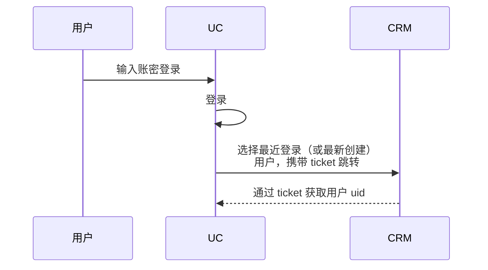

**安全校验**：极验、账密、登录失败次数限制

**业务校验**：套餐、授权、禁用状态、用户状态

**排序**：符合条件的用户进行排序，选择最近登录的用户

**跳转**：根据企业套餐选择跳转 CRM 或 进销存

**错误提示**：安全校验失败提示、业务校验失败提示

#### 2）移动端

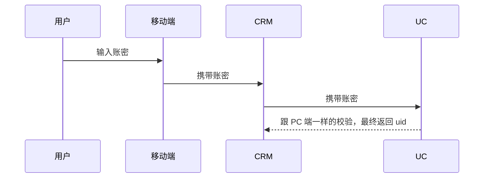

#### 3）openApi 登录

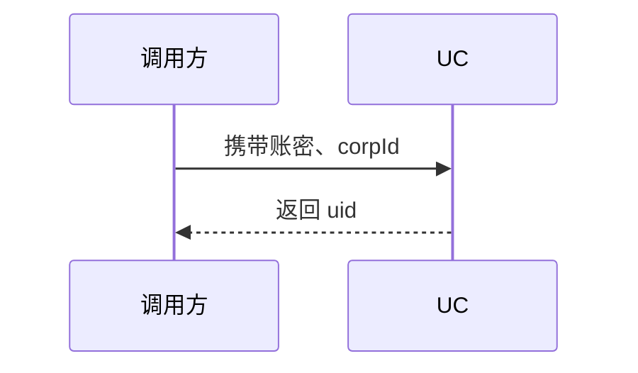

#### 4）切换企业登录

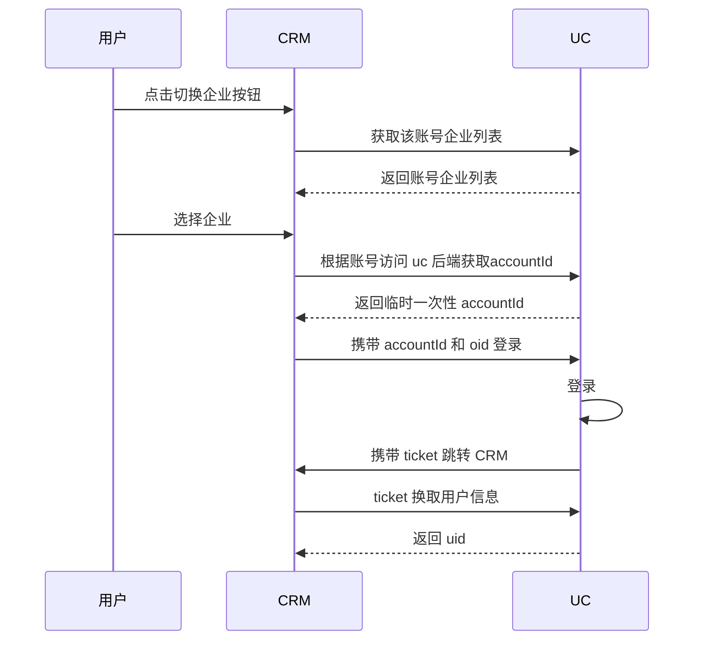

### 2. 企微登录

#### 1）扫码登录

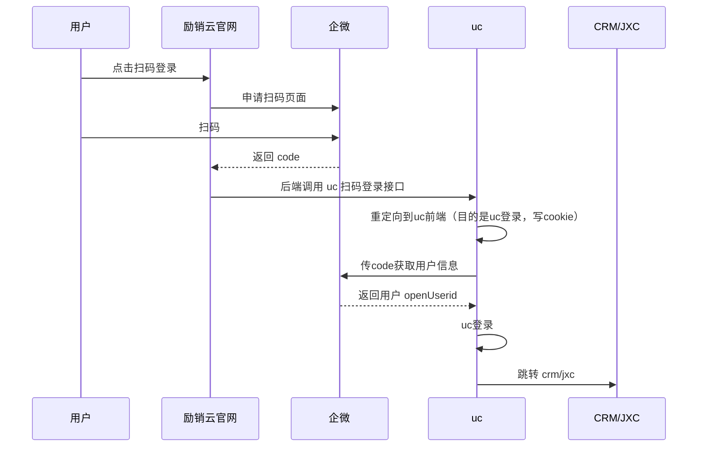

**用户映射关系**：企微 corpid 和 userid --> uid

**安全校验**：uc 后端通过 code 调用企微获取加密用户 openuserid，成功则代表合法

**业务校验**：套餐、授权

**特殊逻辑**：明文转密文 userid、找不到映射用户则新创建用户

#### 2）账密登录

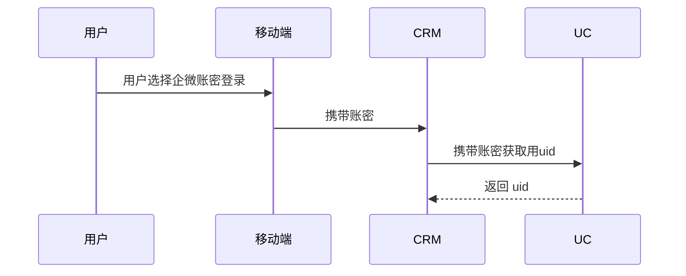

#### 3）免密登录（企微应用内免登、管理员后台免登）

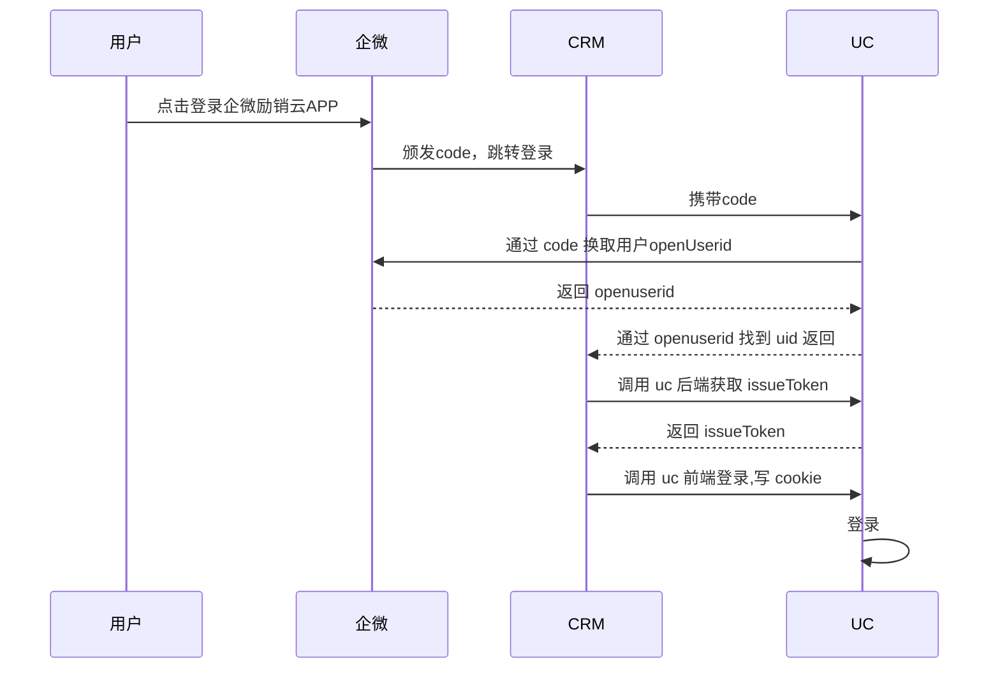

#### 4）自建应用登录（企微助手侧边栏）

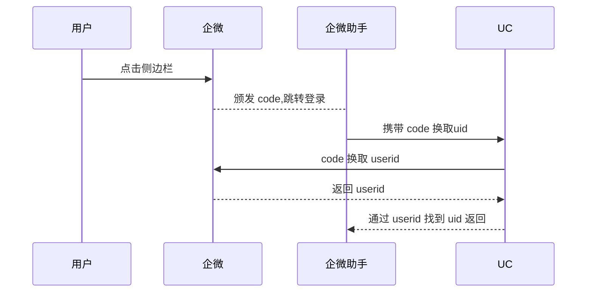

### 3.钉钉登录

#### 免登、扫码登录

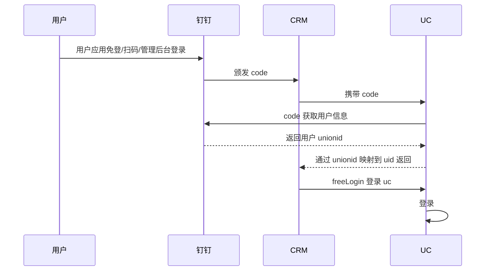

### 4. 腾讯云登录

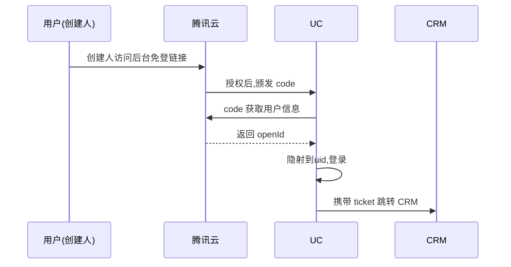

### 5. 千帆营销通登录

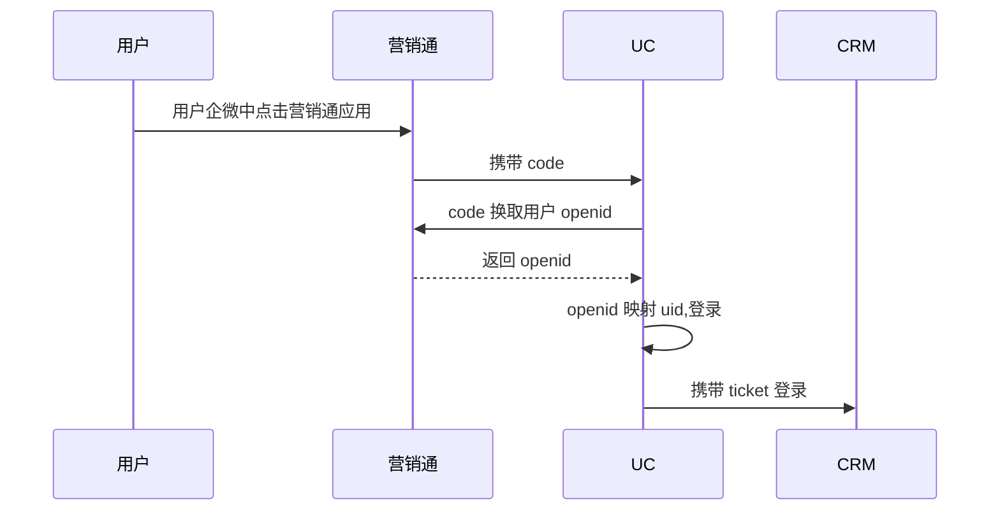

### 6. WPS 登录

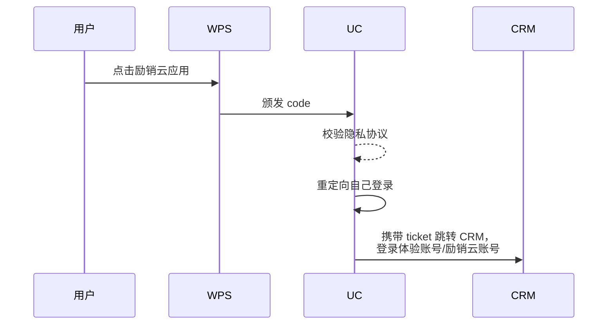

