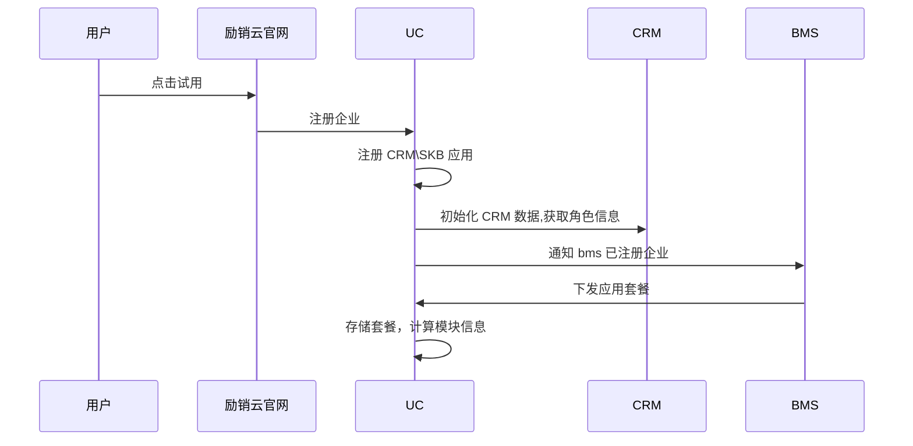
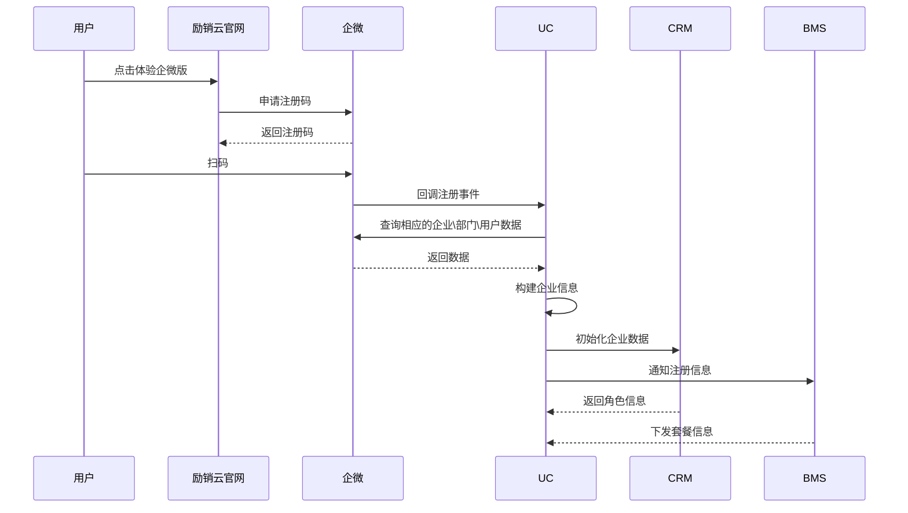
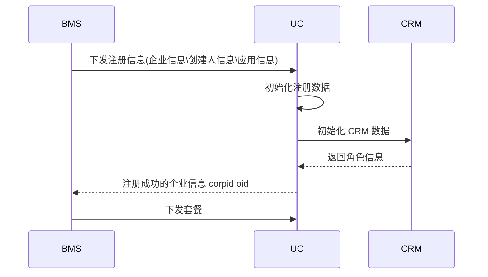
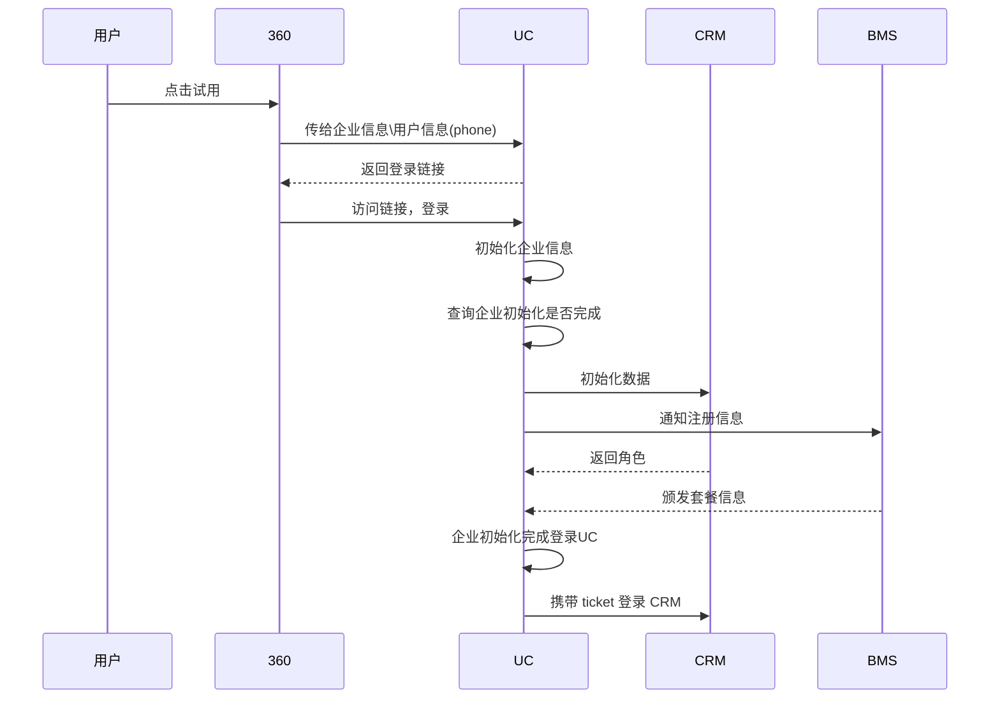
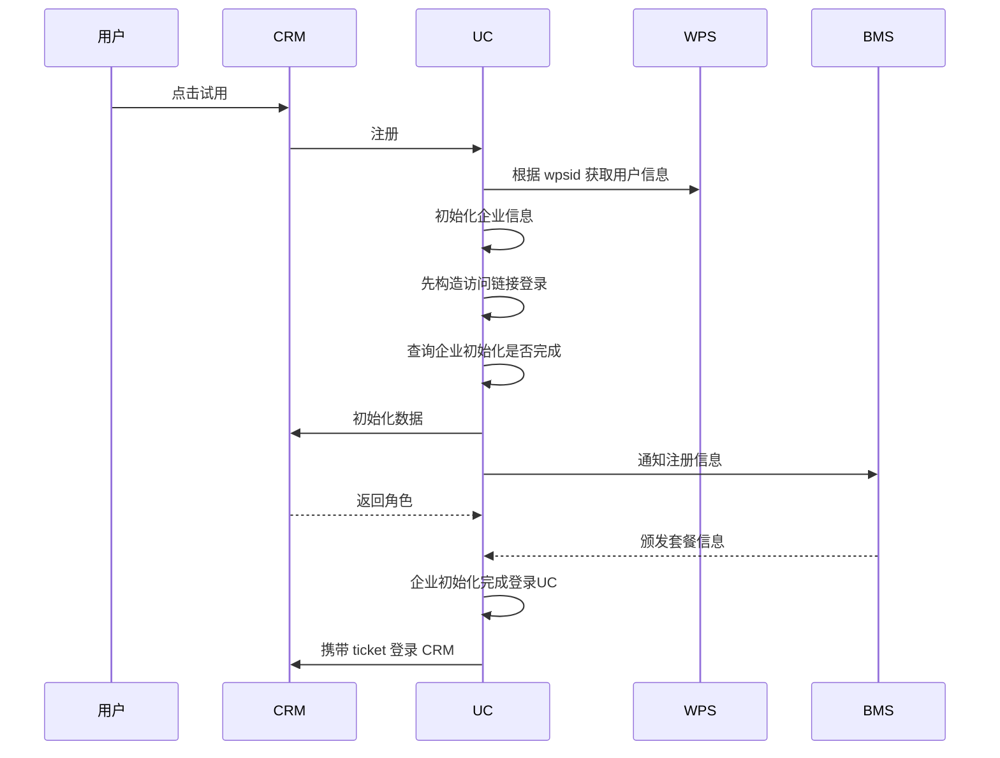
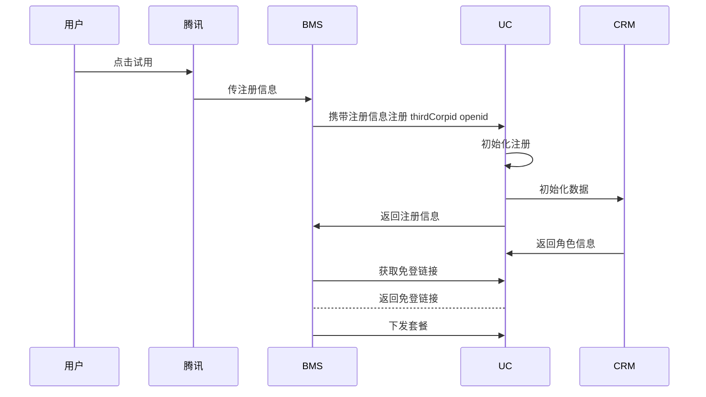

# 企业注册

### 独立版

```mermaid
sequenceDiagram
	用户->>励销云官网:点击试用
	励销云官网->>UC:注册企业
	UC->>UC:注册 CRM\SKB 应用
	UC->>CRM:初始化 CRM 数据,获取角色信息
	UC->>BMS:通知 bms 已注册企业
	BMS->>UC:下发应用套餐
	UC->>UC:存储套餐，计算模块信息
```

### 企微版/钉钉版

```mermaid
sequenceDiagram
	用户->>励销云官网:点击体验企微版
	励销云官网->>企微:申请注册码
	企微-->>励销云官网:返回注册码
	用户->>企微:扫码
	企微->>UC:回调注册事件
	UC->>企微:查询相应的企业\部门\用户数据
	企微-->>UC:返回数据
	UC->>UC:构建企业信息
	UC->>CRM:初始化企业数据
	UC->>BMS:通知注册信息
	CRM-->>UC:返回角色信息
	BMS-->>UC:下发套餐信息
```

### BMS 后台

```mermaid
sequenceDiagram
	BMS->>UC:下发注册信息(企业信息\创建人信息\应用信息)
	UC->>UC:初始化注册数据
	UC->>CRM:初始化 CRM 数据
	CRM-->>UC:返回角色信息
	UC-->>BMS:注册成功的企业信息 corpid oid
	BMS->>UC:下发套餐
```

### 360 试用注册

```mermaid
sequenceDiagram
	用户->>360:点击试用
	360->>UC:传给企业信息\用户信息(phone)
	UC-->>360:返回登录链接
	360->>UC:访问链接，登录
	UC->>UC:初始化企业信息
	UC->>UC:查询企业初始化是否完成
	UC->>CRM:初始化数据
	UC->>BMS:通知注册信息
  CRM-->>UC:返回角色
  BMS-->>UC:颁发套餐信息
  UC->>UC:企业初始化完成登录UC
  UC->>CRM:携带 ticket 登录 CRM
  

```

### wps 试用注册

```mermaid
sequenceDiagram
	用户->>CRM:点击试用
	CRM->>UC:注册
	UC->>WPS:根据 wpsid 获取用户信息
	UC->>UC:初始化企业信息
	UC->>UC:先构造访问链接登录
	UC->>UC:查询企业初始化是否完成
	UC->>CRM:初始化数据
	UC->>BMS:通知注册信息
  CRM-->>UC:返回角色
  BMS-->>UC:颁发套餐信息
  UC->>UC:企业初始化完成登录UC
  UC->>CRM:携带 ticket 登录 CRM
```

### 腾讯云/千帆

```mermaid
sequenceDiagram
	用户->>腾讯:点击试用
	腾讯->>BMS:传注册信息
	BMS->>UC:携带注册信息注册 thirdCorpid openid
	UC->>UC:初始化注册
	UC->>CRM:初始化数据
	UC->>BMS:返回注册信息
	CRM->>UC:返回角色信息
	BMS->>UC:获取免登链接
	UC-->BMS:返回免登链接
	BMS->>UC:下发套餐
	
```

### 中企注册