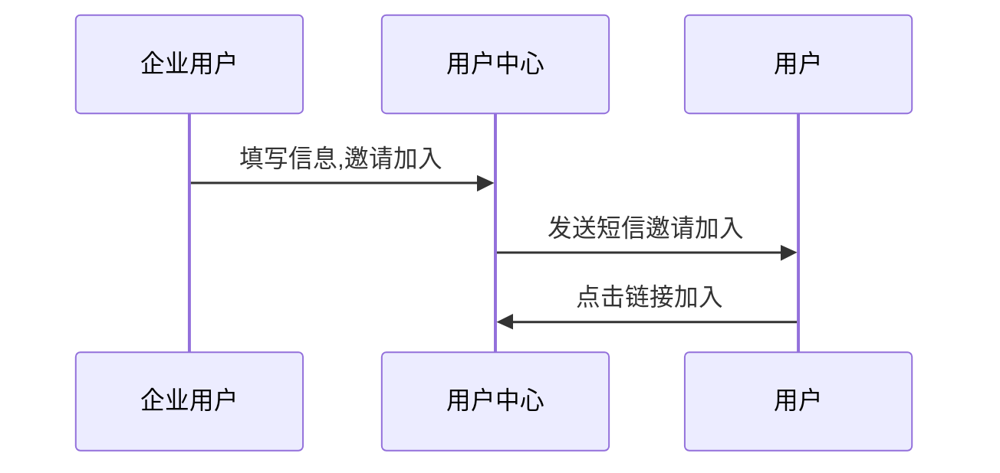
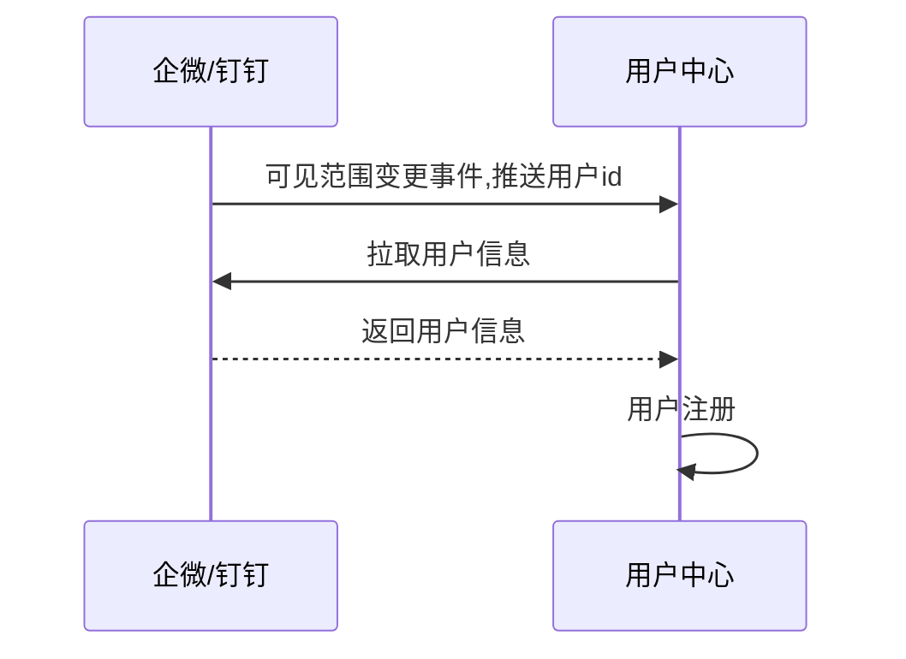
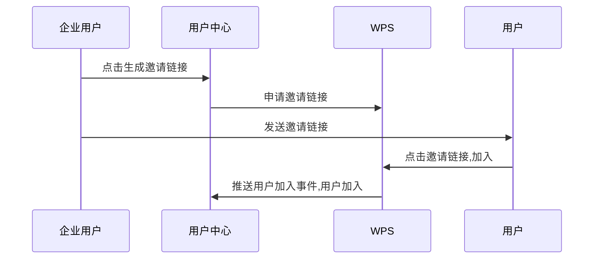

## 独立版

```mermaid
sequenceDiagram
	企业用户->>用户中心:填写信息,邀请加入
	用户中心->>用户:发送短信邀请加入
	用户->>用户中心:点击链接加入
```

## 企微/钉钉

```mermaid
sequenceDiagram
	企微/钉钉->>用户中心:可见范围变更事件,推送用户id
	用户中心->>企微/钉钉:拉取用户信息
	企微/钉钉-->>用户中心:返回用户信息
	用户中心->>用户中心:用户注册
```

## WPS

```mermaid
sequenceDiagram
	企业用户->>用户中心:点击生成邀请链接
	用户中心->>WPS:申请邀请链接
	企业用户->>用户:发送邀请链接
	用户->>WPS:点击邀请链接,加入
	WPS->>用户中心:推送用户加入事件,用户加入
```

